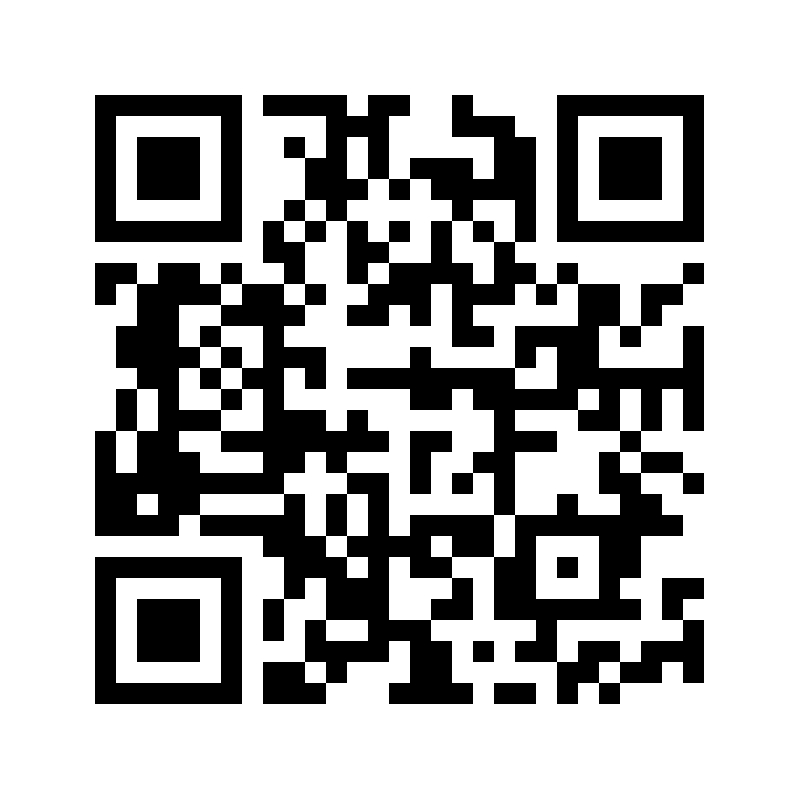
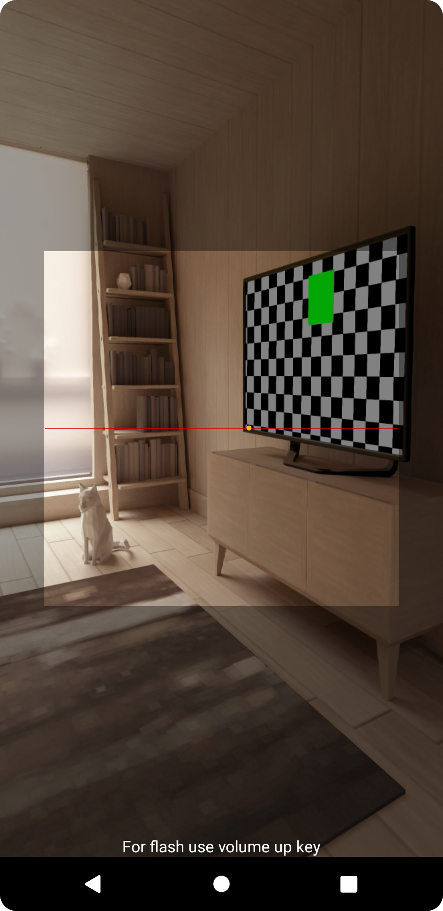

<div align="center">
  
</div>
<h1 align="center"><b>QR Attendance App</b></h1>
<p align="center">QR native android application built and maintained using Java</p>
<div align="center">
  
</div>

# **Documentation and Licence**
* <a href="#forkingNotes">Important forking notes.</a>
* <a href="#appScreens">Application Screens.</a>
* <a href="#problemStatment">Problem Statment.</a>
* <a href="#whyToUse">Why to use.</a>
* <a href="#anaylsisAndSolution">Building and Running for Production.</a>
* <a href="#features">Features.</a>
* <a href="#releases">Releases.</a>

<h2 id="forkingNotes"><b>🚨 Forking this repo (please read!)</b></h2>

if you are asking to use my code for your application, my answer to that question is usually yes, **with attribution**.

I am keeping my code open source, but as you all know, ***plagiarism is bad***. it is a bad thing to find your code in anothor project without giving me ***credit***. This application took long time for me to build and design. so All I ask of you all is to not claim this effort as your own.

Finally, you can fork this repo and give me credit [Muhammad Selim](https://github.com/Mu-selim).


<h2 id="appScreens"><b>📱 Application Screens</b></h2>

| Splash | Home(en) | Capture | Generate(en) | Attendance |
|--------|----------|----------|--------------|------------|
|  | .png) |  | .png) | .png) |

| Home(ar) | Generate(ar) | Spreedsheet |
|----------|--------------|-------------|
| .png) | .png) |  |

<h2 id="problemStatment"><b>Problem Statment</b></h2>

The problem boils down to I can not find a suitable open souce application that can be used to record the attendance based on QR.

QR can facilitate the process of recording attendance **instead** of papers which can save time, make the process faster, clean the environment, and reduce human errors too.


<h2 id="whyToUse"><b>🛠 Why to use</b></h2>

This application can be used to ***scan***, ***generate***, and ***record*** QR codes. The main idea is to create a multi-purpose application that combines the QR operations such as scan, create, save, and etc... in one app.


<h2 id="anaylsisAndSolution"><b>🚀 Building and Running for Production</b></h2>

The application is built to do 3 main operations: [Scan QR](#scan-qr), [Generate and Save QR](#generate-and-save-qr), and [Export attendance as XLS file](#export-attendance-as-xls-file).

### **Scan QR**
The operation sequence is to use camera to scan QR, then the scaned QR using ***IntentIntegrator*** class and after the code is decoded successfully it will be save in the database using [**DatabaseHelper**](app/src/main/java/com/devselim/qrattendace/DatabaseHelper.java) class which stores the **result** and **date of scan**.

### **Generate and Save QR**
In this process the user Type input, which is decoded using **QRGEncoder** class, to an Image.
``` Java
String s = binding.inputField.getText().toString();
QRGEncoder encoder = new QRGEncoder(s, null, QRGContents.Type.TEXT, 800);
binding.generatedQRImage.setImageBitmap(encoder.getBitmap());
```
After the image is generated, if the user press the **Download** button, the generated iamge will be save in local storage using **URI** and **ContentResolver** classes.
``` Java
Uri images;
ContentResolver contentResolver = getContentResolver();
if (Build.VERSION.SDK_INT >= Build.VERSION_CODES.Q) {
    images = MediaStore.Images.Media.getContentUri(MediaStore.VOLUME_EXTERNAL_PRIMARY);
} else {
    images = MediaStore.Images.Media.EXTERNAL_CONTENT_URI;
}
ContentValues contentValues = new ContentValues();
contentValues.put(MediaStore.Images.Media.DISPLAY_NAME, System.currentTimeMillis()+".jpg");
contentValues.put(MediaStore.Images.Media.MIME_TYPE, "images/*");
Uri uri = contentResolver.insert(images, contentValues);
try {
  BitmapDrawable bitmapDrawable = (BitmapDrawable) binding.generatedQRImage.getDrawable();
  Bitmap bitmap = bitmapDrawable.getBitmap();
  OutputStream outputStream = contentResolver.openOutputStream(Objects.requireNonNull(uri));
  bitmap.compress(Bitmap.CompressFormat.JPEG, 100, outputStream);
  Objects.requireNonNull(outputStream);
  Toast.makeText(GenerateActivity.this, "Saved successfully", Toast.LENGTH_LONG).show();
} catch (Exception e) {
  Toast.makeText(GenerateActivity.this, "Image failed to be saved.", Toast.LENGTH_LONG).show();
  e.printStackTrace();
}
```

### **Export attendance as XLS file**
The user can export recorded attendance from Database as XLS file with well organised data(spreadsheet) as the sample below:
<div align="center">
  
</div>


<h2 id="features"><b>🔥 Features</b></h2>

* Multi-purpose app.
* Portrait responsive UI.
* Possibility to save the recorded database as spreadsheet in local storage.


<h2 id="releases"><b>Releases</b></h2>

* [v1.2.1 latest](https://github.com/Mu-selim/QR-attendance/releases/tag/v1.2.0)
* [v1.2.0](https://github.com/Mu-selim/QR-attendance/releases/tag/v1.2.1)
* [v1.0.2](https://github.com/Mu-selim/QR-attendance/releases/tag/v1.0.2)
* [v1.0.1](https://github.com/Mu-selim/QR-attendance/releases/tag/v1.0.1)
* [v1.0.0 Pre-release](https://github.com/Mu-selim/QR-attendance/releases/tag/v1.0.0)